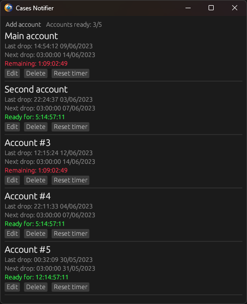

# Case Notifier
### Always know when it's time to farm another case in Counter-Strike.

> Note: Developers recently changed the way cases drop. They now act as a level-up drop, which is reset every wednesday. This app was updated to count time until next wednesday.

## How to use:
1. Add a new account by clicking "Add account" and entering any name and time of last case drop.
2. New account will be added to the list.
3. It will show a countdown until the next case drop, and then show "Ready!" when it's time to farm another case.
4. When you get a case, click "Reset timer" to reset the timer for that account. It will count time until next wednesday from the time you clicked "Reset timer".